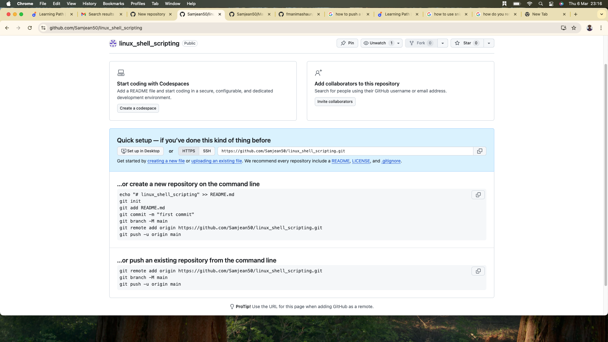

# Capstone Project - Linux Shell Scripting

## Capstone Project: Bash Script For Generating a Multiplication Table. 

### 1. Project Overview

In this project i will create a Bash script that generates a Multiplication table for a number entered by the user. My script should prompt the user to enter a number and then ask if they prefer to see a full multiplication table from 1 to 10 or a partial table within a specified range. Based on the user's choice, the script displays the corresponding multiplication table.
 This project will enable me to use loops, handle user input, and applying conditional logic in Bash scripting.

### 2. Project Steps
#### 2.1. Create Project Directory
* Create a project directory where all the files for the project will be stored.
* Command: 
    ```touch multiplication_table.sh```


#### 2.2. Initialize Git Repository
* Initialize a Git repository in the project directory to track changes.
* Command: ```git init```

 
 #### 2.3. Create a Bash Script File (.sh)
 * Create a shell script file named multiplication table where the Bash code will be written.
 * Command: ```touch multiplication_table```
 


#### 2.4. Make the Script Executable
* Change the file permissions to make the script executable

* Command: 
```chmod+x multiplication-table.sh```


#### 2.5. Set Up Github repository and Link Remote
* Create a Remote Repository on GitHub, then add the remote link to your local Git repository.



### 3. Script Implementation
 #### 3.1. Prompt for User Input

* Use read-p to prompt the user to enter a number for which the multiplication table will be generated.
```sh
read -p "Enter a number: " number
```


 #### 3.2. Ask for Table Type (Full or Partial)
 * Ask the user if they want a full multiplication table (1-10) or a partial one within a specific range.
```sh
echo "Do you want a full table or a partial table?
(Enter 'f' for full, 'p' for partial)"
read table_choice
```


#### 3.3. Full Multiplication Table
* If the user selects the full table option (f), display the multiplication table from 1 to 10 in ascending order.
```sh
if [ "$table_choice" == "f" ]; then
"Multiplication table for $number (Ascending):"
# Generate the full multiplication table in ascending order
  for i in {1..10}; do
    result=$((number * i))
    # Display result for the full table
    echo "$number x $i = $result"
  done
  ```


#### 3.4. Partial Multiplication Table
* If the user chooses the partial option (p), prompt for a custom range (start and end numbers).
```sh # Validate the range
  if [ "$start_number" -le "$end_number" ]; then
    echo "Partial Multiplication table for $number from $start_number to $end_number (Ascending order)."
    for i in $(seq $start_number $end_number); do
      result=$((number * i ))
      # Display result for partial table
      echo "$number x $i = $result"
    done
  else
    echo "Invalid range. The start number must be less than or equal to the end number."
fi
```


### 4. Troubleshooting (Common Issues and Solutions)
### 4.1. Script Permission Denied
- If you encounter a “Permission Denied” error when running the script, ensure the script has executable permissions.
* Solution: ```Run chmod +x multiplication_table.sh``` to make the script executable.
4.2. Invalid Input for Number
- If the user enters a non-numeric value, the script may behave unexpectedly as it expects a number for multiplication.
* Solution: Add input validation to ensure that only numbers are accepted. For example:

```sh 
if ! [[ "$number" =~ ^[0-9]+$ ]]; then
echo "Invalid input. Please enter a valid number."
exit 1
fi
```
4.3. Invalid Range in Partial Table
- If the user inputs a start number greater than the end number, the script will display an "Invalid range" error.
* Solution: Make sure the start number is less than or equal to the end number, as shown in the range validation code.
4.4. Git Remote Connection Issues
- If you have trouble pushing code to the GitHub repository, verify that the remote URL is correct and that you have the necessary permissions.
* Solution: Run git remote -v to check the remote URL and verify access. If there are issues, re-add the remote with the correct URL using git remote add origin <repository_url>.
